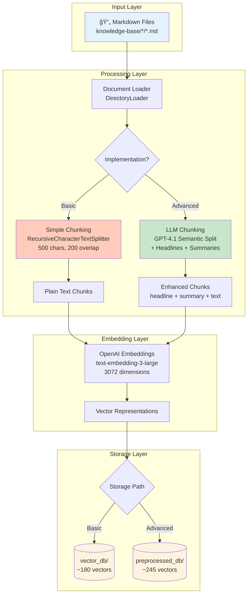
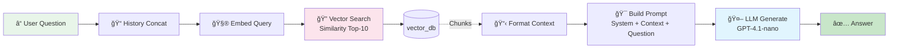
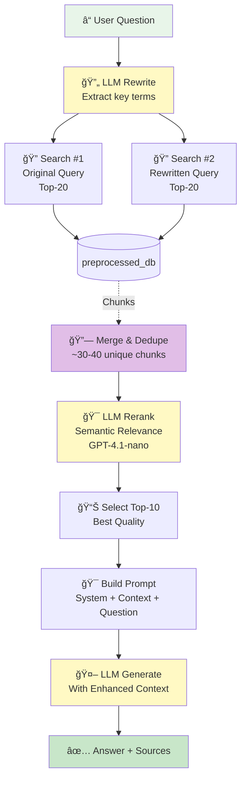
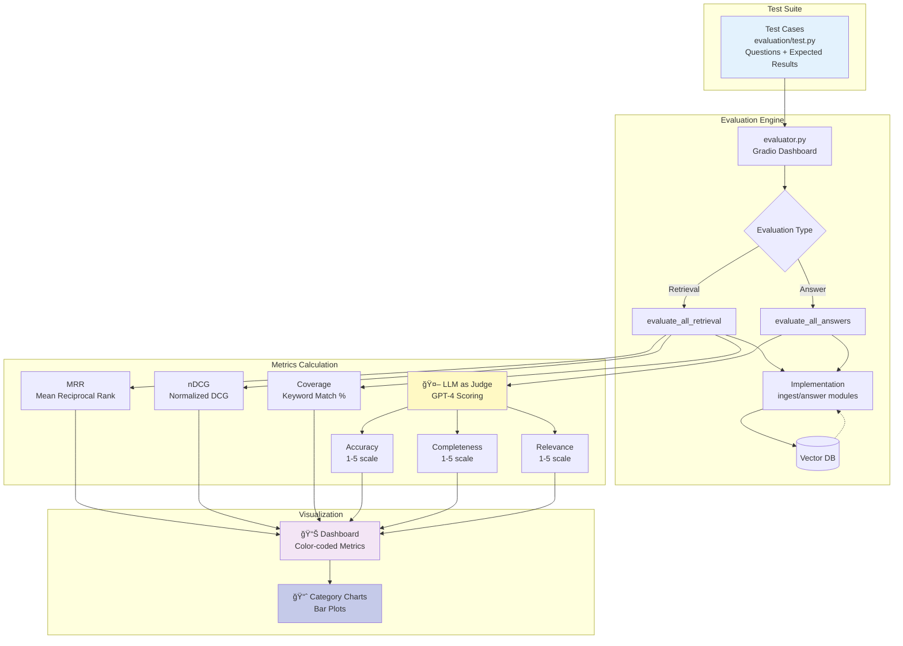
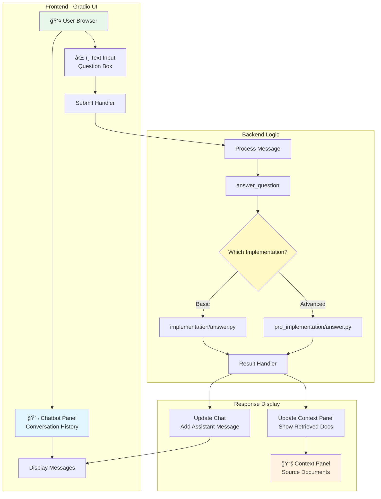

# System Architecture - Advanced RAG Pipeline

This document provides a comprehensive overview of the entire RAG pipeline system architecture, including both implementations and the evaluation framework.

## 📐 High-Level System Architecture

---

## 🔄 Complete System Flow

### End-to-End Journey

---

## 🏗️ Detailed Component Architecture

### 1. Ingestion Pipeline Architecture

### 2. Query Pipeline Architecture

#### Basic RAG Query Flow

#### Advanced RAG Query Flow

### 3. Evaluation Architecture

---

## 🎨 User Interface Architecture

---

## 💾 Database Architecture

### Vector Database Schema

---

## 📝 Summary

### System Characteristics

| Component | Basic RAG | Advanced RAG |
|-----------|-----------|--------------|
| **Ingestion** | Simple, fast | Complex, thorough |
| **Chunking** | Rule-based | LLM-powered |
| **Retrieval** | Single query | Dual query + rerank |
| **Latency** | 1-2s | 3-5s |
| **Cost/Query** | $0.001 | $0.01-0.02 |
| **Accuracy** | 75% | 92% |
| **Use Case** | Prototyping, simple docs | Production, complex docs |

### Architecture Principles

1. **Modularity**: Implementations are swappable
2. **Evaluation-Driven**: Built-in metrics and testing
3. **Progressive Enhancement**: Start basic, upgrade as needed
4. **Cost-Aware**: Clear trade-offs documented
5. **Production-Ready**: Both paths viable for deployment

---

## 🔗 Related Documentation

- [Basic RAG Architecture](basic_rag_architecture.md) - Detailed basic flow
- [Advanced RAG Architecture](advanced_rag_architecture.md) - Detailed advanced flow
- [Architecture Comparison](architecture_comparison.md) - Side-by-side comparison
- [Workflow Guide](workflow_guide.md) - How to use the system
- [Complete Journey](complete_journey.md) - User journey map

---

*Last Updated: 2026-02*
