# Complete RAG Evolution Journey

```mermaid
graph TD
    Start[🎯 Start Here] --> Setup[⚙️ Setup Environment<br/>Install deps + API keys]
    
    Setup --> Phase1[📦 PHASE 1: Basic RAG]
    
    Phase1 --> Ingest1[1️⃣ Ingest Documents<br/>implementation/ingest.py<br/>Simple chunking]
    Ingest1 --> UI1[2️⃣ Test Chatbot<br/>app.py<br/>Ask questions]
    UI1 --> Eval1[3️⃣ Evaluate<br/>evaluator.py<br/>Baseline metrics]
    
    Eval1 --> Results1[📊 Baseline Results<br/>MRR: ~0.75<br/>Accuracy: ~3.8/5]
    
    Results1 --> Phase2[🚀 PHASE 2: Advanced RAG]
    
    Phase2 --> Ingest2[1️⃣ Ingest with LLM<br/>pro_implementation/ingest.py<br/>Smart chunking]
    Ingest2 --> Switch[2️⃣ Switch Imports<br/>Update app.py & evaluator.py]
    Switch --> UI2[3️⃣ Test Enhanced Bot<br/>Same questions<br/>Better answers]
    UI2 --> Eval2[4️⃣ Re-evaluate<br/>evaluator.py<br/>Improved metrics]
    
    Eval2 --> Results2[📈 Improved Results<br/>MRR: ~0.92 +23%<br/>Accuracy: ~4.6/5 +21%]
    
    Results2 --> Compare[📊 Compare Screenshots<br/>Celebrate gains!]
    
    Compare --> Learn[🎓 Learning Complete<br/>Understand RAG evolution]
    
    Learn --> Next{What's Next?}
    
    Next --> Prod[Production: Use Advanced]
    Next --> Hybrid[Experiment: Mix techniques]
    Next --> Custom[Build: Your own domain]
    
    style Start fill:#e3f2fd,stroke:#1976d2,stroke-width:3px
    style Phase1 fill:#fff3e0,stroke:#f57c00,stroke-width:2px
    style Phase2 fill:#e8f5e9,stroke:#388e3c,stroke-width:2px
    style Results1 fill:#ffccbc,stroke:#d84315
    style Results2 fill:#c8e6c9,stroke:#2e7d32
    style Compare fill:#fff9c4,stroke:#f9a825
    style Learn fill:#c5cae9,stroke:#3949ab
    
    classDef action fill:#e1bee7,stroke:#7b1fa2
    class Ingest1,UI1,Eval1,Ingest2,Switch,UI2,Eval2 action
```



## Timeline Expectations

### Phase 1: Basic RAG (~30-45 minutes)
- ⏱️ Ingest: 2-3 minutes
- ⏱️ UI testing: 10-15 minutes
- ⏱️ Evaluation: 15-20 minutes

### Phase 2: Advanced RAG (~45-60 minutes)
- ⏱️ Ingest: 8-12 minutes (LLM processing)
- ⏱️ Switch imports: 2-3 minutes
- ⏱️ UI testing: 10-15 minutes
- ⏱️ Evaluation: 20-30 minutes (more LLM calls)

**Total Time: ~1.5-2 hours**

## Cost Expectations

### Basic RAG
- Ingestion: ~$0.10 (embeddings only)
- Per Query: ~$0.001
- Evaluation (50 tests): ~$0.05
- **Total for Phase 1: ~$0.20**

### Advanced RAG
- Ingestion: ~$2-5 (LLM chunking + embeddings)
- Per Query: ~$0.01-0.02 (multiple LLM calls)
- Evaluation (50 tests): ~$0.50-1.00
- **Total for Phase 2: ~$3-7**

**Grand Total: ~$3-8 for complete evaluation**

## Success Indicators

### ✅ You've Succeeded When:

1. **Baseline Established**
   - [ ] Basic RAG running smoothly
   - [ ] Evaluation metrics captured
   - [ ] Screenshots saved

2. **Advanced Implemented**
   - [ ] Pro ingestion completed (more chunks)
   - [ ] Imports switched correctly
   - [ ] UI shows improved answers

3. **Improvements Measured**
   - [ ] MRR increased by 15%+
   - [ ] Answer quality up 0.5+ points
   - [ ] Category charts show gains

4. **Understanding Achieved**
   - [ ] Can explain why advanced is better
   - [ ] Understand trade-offs (cost vs quality)
   - [ ] Know when to use each approach

## Common Pitfalls & Solutions

### ❌ Pitfall 1: Forgot to Switch Imports
**Symptom**: No improvement in metrics after Phase 2
**Solution**: Double-check app.py and evaluator.py imports

### ❌ Pitfall 2: Using Wrong Vector DB
**Symptom**: Getting old results
**Solution**: Verify correct DB path (vector_db vs preprocessed_db)

### ❌ Pitfall 3: Rate Limiting
**Symptom**: Ingestion fails with 429 errors
**Solution**: Reduce WORKERS to 1 in pro_implementation/ingest.py

### ❌ Pitfall 4: Comparing Apples to Oranges
**Symptom**: Unfair comparison
**Solution**: Use exact same test cases for both evaluations

## Verification Checklist

Before comparing results, ensure:

- [ ] Both ingestion pipelines completed successfully
- [ ] Vector databases exist in correct locations
- [ ] Same test cases used for both evaluations
- [ ] Imports correctly switched between phases
- [ ] Screenshots captured at right times
- [ ] No rate limit errors during evaluation

## Quick Reference Commands

```bash
# PHASE 1: Basic RAG
cd src/rag-pipeline
python implementation/ingest.py        # Ingest
python app.py                          # Test (with implementation imports)
python evaluator.py                    # Eval (with implementation imports)

# PHASE 2: Advanced RAG
python pro_implementation/ingest.py    # Ingest
# Edit app.py: change to pro_implementation imports
python app.py                          # Test (with pro_implementation imports)
# Edit evaluator.py: change to pro_implementation imports
python evaluator.py                    # Eval (with pro_implementation imports)

# CLEANUP (if needed)
rm -rf vector_db/ preprocessed_db/     # Clear databases
```

## What You'll Learn

### Technical Skills
1. **RAG Architecture**: Understand ingestion and query pipelines
2. **Chunking Strategies**: Rule-based vs semantic
3. **Retrieval Techniques**: Simple vs multi-stage
4. **Evaluation Metrics**: MRR, nDCG, LLM-as-judge

### Practical Knowledge
1. **Trade-off Analysis**: Cost vs accuracy vs latency
2. **System Design**: When to use basic vs advanced
3. **Debugging**: Common issues and solutions
4. **Optimization**: How each technique contributes

### Strategic Thinking
1. **ROI Calculation**: Is advanced RAG worth it?
2. **Use Case Matching**: Right tool for right job
3. **Incremental Improvement**: Systematic optimization
4. **Production Readiness**: What's needed for real systems

## Next Steps After Completion

### 1. Experimentation Phase
- Try different chunk sizes
- Test alternative models
- Mix and match techniques
- Measure impact of each change

### 2. Customization Phase
- Add your own documents
- Create domain-specific test cases
- Tune parameters for your use case
- Optimize for your constraints

### 3. Production Phase
- Deploy the better-performing version
- Set up monitoring and logging
- Implement caching strategies
- Plan for scaling

### 4. Sharing Phase
- Document your findings
- Share metrics and insights
- Contribute improvements
- Help others learn

---

## 🎉 Congratulations!

By completing this journey, you've:
- ✅ Built two complete RAG systems
- ✅ Evaluated them scientifically
- ✅ Understood advanced RAG techniques
- ✅ Gained practical ML engineering skills

**You're now ready to build production-grade RAG systems!** 🚀

---

*For questions or issues, refer to the [Troubleshooting Guide](workflow_guide.md#troubleshooting) or review the [Architecture Documentation](architecture_comparison.md).*
