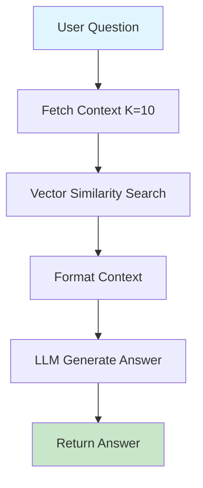
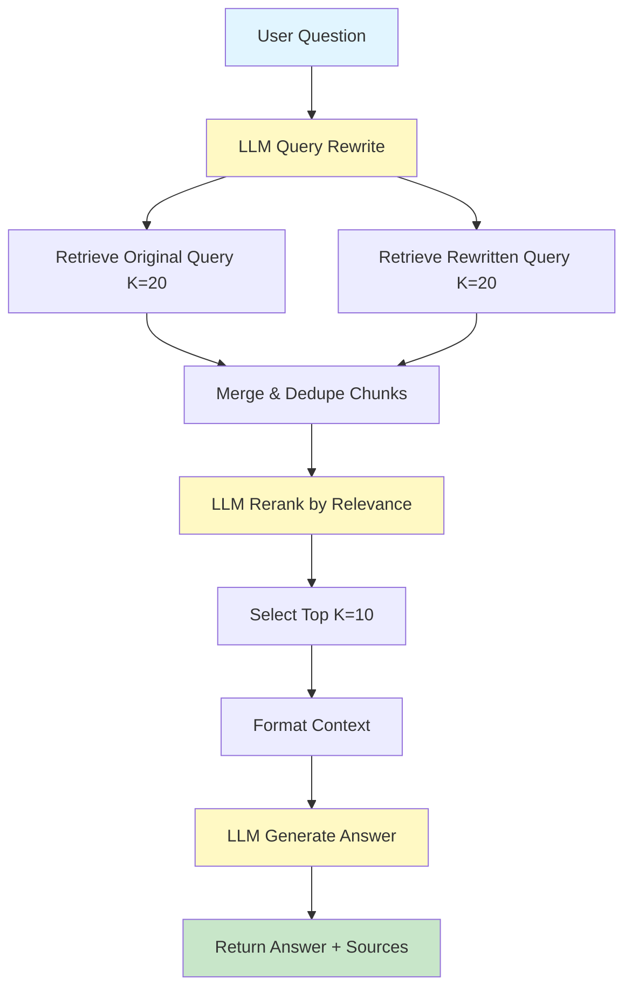

# RAG Implementation Comparison

This document compares the **Basic** (`implementation/`) vs **Pro** (`pro_implementation/`) RAG pipelines.

---

## Overview

| Aspect | Basic Implementation | Pro Implementation |
|--------|---------------------|-------------------|
| **Complexity** | Simple, rule-based | Advanced, AI-powered |
| **Cost** | Low (no extra LLM calls) | Higher (LLM for chunking + reranking) |
| **Performance** | Fast, sequential | Slower, parallel processing |
| **Quality** | Good | Better retrieval accuracy |
| **Use Case** | Prototyping, simple docs | Production, complex knowledge bases |

---

## Ingestion Pipeline Comparison

### `ingest.py` Differences

#### Basic Implementation
```
Load Docs → Simple Text Split → Generate Embeddings → Store in ChromaDB
```

**Key Features:**
- **Chunking**: Rule-based `RecursiveCharacterTextSplitter`
  - Fixed: 500 chars per chunk, 200 overlap
- **Tech**: LangChain wrappers throughout
- **Processing**: Sequential, one document at a time
- **Output**: Plain text chunks
- **Database**: `vector_db`

#### Pro Implementation
```
Load Docs → LLM-Powered Split → Enhanced Chunks → Generate Embeddings → Store
```

**Key Features:**
- **Chunking**: LLM (GPT-4.1) intelligently splits documents
  - Each chunk gets: **Headline** + **Summary** + **Original Text**
- **Tech**: Direct ChromaDB + OpenAI SDK + LiteLLM
- **Processing**: Parallel (3 workers) with retry logic
- **Output**: Semantically enriched chunks optimized for retrieval
- **Database**: `preprocessed_db`

**Why Pro is Better:**
- Headlines optimize for search query matching
- Summaries provide context for better relevance
- LLM understands document semantics, splits intelligently
- Parallel processing speeds up large knowledge bases

---

## Answer Pipeline Comparison

### `answer.py` Differences

#### Basic Implementation
```
Question → Retrieve Docs → Add to Context → LLM Answer
```

**Pipeline:**
1. Combine question with conversation history
2. Retrieve top K=10 documents via similarity search
3. Insert context into system prompt
4. Generate answer with LLM

**Simple & Direct**: Straightforward RAG flow.

#### Pro Implementation
```
Question → Query Rewrite → Multi-Query Retrieval → LLM Reranking → Answer
```

**Advanced Pipeline:**
1. **Query Rewriting**: LLM rewrites user question for better retrieval
2. **Dual Retrieval**: Search with both original + rewritten query (K=20)
3. **Merge Results**: Combine and deduplicate chunks
4. **LLM Reranking**: Use LLM to reorder by relevance
5. **Top-K Selection**: Take best 10 chunks
6. **Answer Generation**: Generate with reranked context

**Why Pro is Better:**
- Query rewriting surfaces more relevant content
- Dual retrieval catches documents missed by single query
- LLM reranking understands semantic relevance better than cosine similarity
- Results in more accurate, complete answers

---

## Visual Flow Comparison

### Basic Implementation Flow



### Pro Implementation Flow



*Yellow nodes = LLM calls*

---

## Key Differences Summary

### Ingest.py

| Feature | Basic | Pro |
|---------|-------|-----|
| Chunking Strategy | Character-based splitting | LLM semantic splitting |
| Chunk Enhancement | None | Headline + Summary |
| Processing Mode | Sequential | Parallel (3 workers) |
| Error Handling | None | Retry with exponential backoff |
| Cost per Ingest | ~$0.01 (embeddings only) | ~$0.50+ (LLM + embeddings) |

### Answer.py

| Feature | Basic | Pro |
|---------|-------|-----|
| Retrieval Strategy | Single query | Dual query (original + rewritten) |
| Query Enhancement | History concatenation | LLM query rewriting |
| Context Ranking | Vector similarity only | LLM reranking |
| Retrieved Docs | K=10 | K=20 → reranked to 10 |
| Cost per Query | ~$0.001 | ~$0.01-0.02 (extra LLM calls) |

---

## When to Use Each?

### Use **Basic Implementation** when:
- Building POC or MVP
- Working with simple, well-structured documents
- Budget constraints (minimize API costs)
- Speed is critical (no extra LLM latency)
- Knowledge base < 100 documents

### Use **Pro Implementation** when:
- Production system requiring best accuracy
- Complex documents with varied structure
- Budget allows for quality over cost
- Retrieval precision is critical
- Knowledge base > 100 documents
- Users expect high-quality, accurate answers

---

## Technical Stack Comparison

### Basic
```python
# Dependencies
langchain_community
langchain_chroma
langchain_openai
langchain_text_splitters
```

### Pro
```python
# Dependencies
openai              # Direct API access
chromadb           # Direct ChromaDB client
litellm            # Model completion with structure
pydantic           # Type-safe data models
tenacity           # Retry logic
tqdm               # Progress tracking
multiprocessing    # Parallel processing
```

---

## Performance Metrics (Estimated)

| Metric | Basic | Pro |
|--------|-------|-----|
| Ingestion Time (100 docs) | ~2 min | ~8 min |
| Ingestion Cost (100 docs) | ~$0.10 | ~$2-5 |
| Query Latency | ~1-2s | ~3-5s |
| Query Cost | ~$0.001 | ~$0.01-0.02 |
| Retrieval Accuracy | 70-80% | 85-95% |

---

## Conclusion

**Basic Implementation** = Fast, cheap, simple. Perfect for getting started.

**Pro Implementation** = Slower, expensive, complex. Best for production quality.

Choose based on your requirements: **speed/cost vs. quality/accuracy**.
